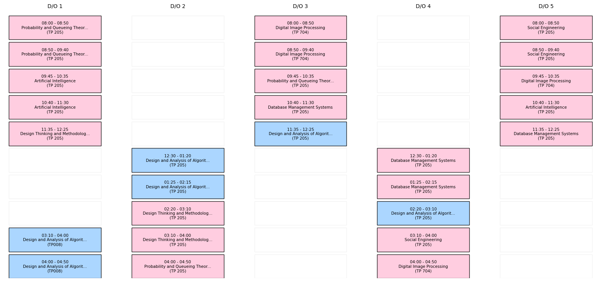
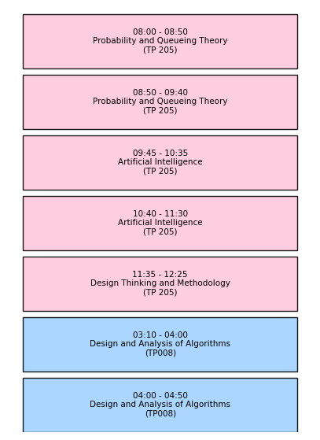
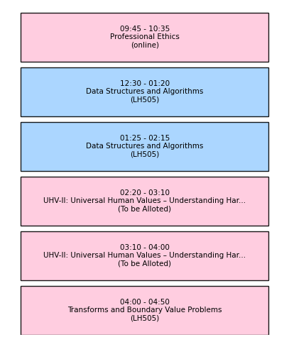
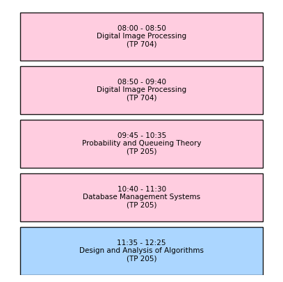
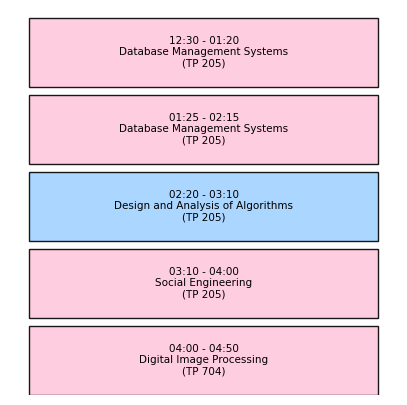
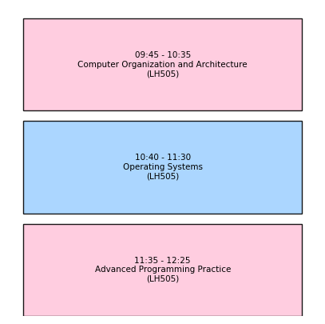

📅 Auto-Generated Academic Timetable Visualizer
This project reads calendar and schedule JSON data and generates high-quality visual timetables for each Day Order (D/O). The visuals are clean, color-coded, and optimized for quick viewing.

🔧 Features
📅 Individual Day Order Timetables (D/O 1 to 5)

🧠 Smart color coding:

🟦 Lab Based Theory → Soft Blue (#A2D2FF)

🩷 Regular Theory → Soft Pink (#FFC8DD)

⚪ Free Slots → Transparent White

🌐 Base64 JSON Export for embedding in other systems

🖼️ Transparent PNGs for easy overlay or publishing

📁 Output Directory: t_data/
pgsql
Copy
Edit
t_data/
├── timetable_base64.json ← Base64 JSON with all images
├── timetable_combined.png ← Combined view (D/O 1 to 5 side-by-side)
├── timetable_do1.png ← Individual D/O 1
├── timetable_do2.png
├── timetable_do3.png
├── timetable_do4.png
└── timetable_do5.png
🖼️ Preview
✅ Combined Timetable View
All 5 upcoming Day Orders rendered together side-by-side:

📌 Individual D/O Timetables
Day Order	Image Preview
D/O 1	
D/O 2	
D/O 3	
D/O 4	
D/O 5	

📦 JSON Format (Base64 Output)
The file t_data/timetable_base64.json contains all rendered timetables in base64 format, like this:

json
Copy
Edit
{
"combined": "iVBORw0KGgoAAAANSUhEUgAAA...",
"individual": [
{
"do": "1",
"date": "2025-08-04",
"day": "Monday",
"image": "iVBORw0KGgoAAAANSUhEUgAAA..."
},
...
]
}
💡 These can be embedded directly into web dashboards, APIs, or mobile apps.

📜 How It Works
Load calendar_events.json and timetable.json

Map dates to academic Day Orders (D/Os)

Render each day visually using matplotlib

Export:

Individual timetable PNGs

Combined PNG

Base64-encoded JSON

📬 Want to Integrate?
You can use the JSON or images for:

Student portals

Calendar integration

Schedule visualizers

PDF or email reports
